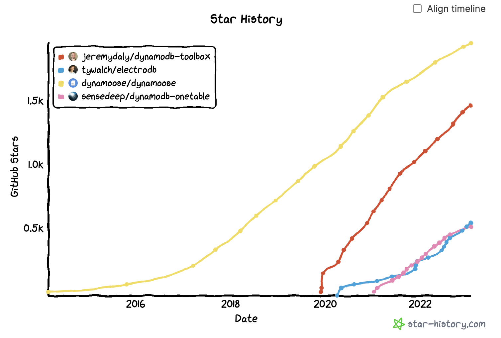

AWS DynamoDB is a [key-value database designed to run high-performance applications at any scale](https://aws.amazon.com/dynamodb). It automatically scales up and down based on your current traffic, and does not require maintaining connections (as requests are sent over HTTP), which makes it the **go-to DB service for serverless developers on AWS**.

Because it’s 2023 and no-one writes HTTP requests anymore, AWS published a SDK called the [document client](https://docs.aws.amazon.com/sdk-for-javascript/v3/developer-guide/dynamodb-example-dynamodb-utilities.html) to craft said requests. However, if you’ve ever used it, you will know that **it’s still very painful to use**.

For instance, let’s look at this `UpdateCommand` example from the [DynamoDB docs itself](https://docs.aws.amazon.com/amazondynamodb/latest/developerguide/GettingStarted.UpdateItem.html):

```tsx
await DocumentClient.send(
  new UpdateCommand({
    TableName: 'TABLE_NAME',
    Key: {
      // 👇 No type-safety on the primary key
      title: 'MOVIE_NAME',
      year: 'MOVIE_YEAR',
    },
    // 👇 String expressions hard to build (and still no type-safety)
    UpdateExpression: 'set info.plot = :p, info.#r = :r',
    // 👇 When used in Expressions, attribute names have to be provided separately
    ExpressionAttributeNames: {
      '#r': 'rank',
    },
    // 🤦‍♂️ List of attribute names as strings separated by commas
    ProjectionExpression: '#r',
    // 👇 Attribute values have to be provided separately
    ExpressionAttributeValues: {
      // 👇 No validation or type-safety to enforce DB schema
      ':p': 'MOVIE_PLOT',
      ':r': 'MOVIE_RANK',
    },
  }),
);
```

It is a very simple example (updating two fields of a `Movie` item), yet already very verbose 😅 And **things only get messier as the complexity of your business logic grows**: What if your items have 20 attributes? With some of them deeply nested? Or optional? What if you want to index an item or not depending on its values (e.g. a `status` attribute)? What about polymorphism?

In those cases (which are quite common) **the required code to generate those requests can get very hard to maintain**. That is why, very early on, developers built open-source libraries to “wrap” the DynamoDB client, with two goals in mind:

- 🏋️‍♀️ Simplifying the writing of DynamoDB requests
- 📐 Adding run-time **data validation**, i.e. **“artificial” schemas** to a schema-less DB (and more recently type-safety)

For instance, here is an example of the same `UpdateCommand` with one of those wrappers, [DynamoDB-Toolbox](https://github.com/jeremydaly/dynamodb-toolbox):

```tsx
import { Table, Entity } from 'dynamodb-toolbox';

// Provided some minor boilerplate...
const MovieTable = new Table({
  name: 'TABLE_NAME',
  partitionKey: 'title',
  sortKey: 'year',
  DocumentClient, // <= the original DocumentClient
});

const MovieEntity = new Entity({
  name: 'Customer',
  attributes: {
    title: { partitionKey: true, type: 'string' },
    year: { sortKey: true, type: 'string' },
    info: { type: 'map' },
  },
  table: MovieTable,
} as const);

// ...we get a validated AND type-safe request method 🙌
await MovieEntity.update({
  title: 'MOVIE_NAME',
  year: 'MOVIE_YEAR',
  info: {
    plot: 'MOVIE_PLOT',
    rank: 'MOVIE_RANK',
  },
});
```

And just like that, we went from an obscure 18-line object to a readable and elegant 8-liner 🤩 Not bad, don't you think?

DynamoDB-Toolbox is not the only SDK wrapper out there. If you browse Alex DeBrie’s [awesome-dynamodb-tools](https://github.com/alexdebrie/awesome-dynamodb#tools) repo, you’ll actually find a bunch of them. So, **which one should you chose?**

In this article, we took an in depth comparison of the **4 most popular DynamoDB wrappers**:

- 🦌 **Dynamoose**: Dynamoose is the OG of DynamoDB wrappers. Created in 2015, it provides a syntax that closely mirrors that of the popular Mongoose library for MongoDB.
- 🧰 **DynamoDB Toolbox**: DynamoDB-Toolbox was created by Jeremy Daly, AWS Serverless Hero, and writer of the newsletter [off-by-none](https://offbynone.io/). It was first released in September 2018 and has gained in popularity ever since.
- ⚡️ **ElectroDB**: Released in April 2020 by [Tyler W. Walsh](https://twitter.com/tinkertamper), ElectroDB benefits from having been created after Typescript won over the JS ecosystem. So it has a higher focus on type-safety than its predecessors.
- 💍 **DynamoDB-OneTable**: First released in January 2021, DynamoDB-OneTable is maintained by [Sensedeep](https://www.sensedeep.com/) and is part of its broader [Serverless Developer Studio](https://www.sensedeep.com/product/) offer.

We ranked them based on the following criteria:

- 📣 **Library state**: Classic open-source KPIs such as number of downloads, community, documentation etc.
- 🏗️ **Data modeling**: The broadness of their Entity definition API. Do they allow attribute name re-mapping (useful for [single-table design](https://www.alexdebrie.com/posts/dynamodb-single-table/))? Do they support enums? Nested attributes definitions? Computing indexes from other attributes?
- ✨ **Typescript support**: Type-safety is all the rage these days! All libraries come with some sort of type-safety, but type-inference (i.e. inferring tailored types from custom schemas) is still hard to get right.
- 🤖 **API**: How easy it is to do common DynamoDB requests like `put`, `get` or `query`... with secondary indexes, filters and conditions (You can find examples for each wrapper in [our dedicated repo](https://github.com/theodo/dynamodb-tools)).

## 📣 Library state

| (\*as of 2023/02) | 🦌 Dynamoose | 🧰 DynamoDB-Toolbox | ⚡️ ElectroDB | 💍 DynamoDB-OneTable |
| --- | --- | --- | --- | --- |
| **First release date** | 2014-02-27 | 2019-11-20 | 2020-03-11 | 2021-01-12 |
| **Last release date** | ✅ Jan. 6, 2023 | ✅ Jan. 8, 2023 | ✅ Jan. 20, 2023 | ✅ Jan. 25, 2023 |
| **Github ⭐️** | 1900 | 1400 | 530 | 505 |
| **NPM weekly downloads** | 86 k | 38 k | 4 k | 16 k |
| **Bundle size** | 🟡 382 kB | ✅ 64.1 kB | 🟡 176.7 kB | ✅ 64.3 kB |
| **Documentation** | ✅ | ✅ | 🟡 No global search | ❌ Can be improved |
| **DynamoDB Client v3 compatibility** | ✅ | ❌ | ✅ | ✅ |

All four libraries are well maintained, and have enough GitHub stars and npm downloads to be considered “battle tested”.

Dynamoose has the highest stats (probably from being the first one around). However, it’s the heaviest, with a size of 382KB, which is not negligible, considering that [bundles above 5MB negatively impact Lambdas cold starts](https://mikhail.io/serverless/coldstarts/aws/).



The main takeaways are that DynamoDB-Toolbox is not compatible with the V3 of the DynamoDB client (though [it should be coming soon](https://github.com/jeremydaly/dynamodb-toolbox/pull/174)), and that the DynamoDB-OneTable documentation leaves to be desired.

## 🏗️ Data modeling

We initially started with a very broad scope of features useful for Entity definition (like specifying attributes as required, or aliasing attributes). However, most of them were already implemented by all libraries. For the sake of simplicity, we removed them and kept the following ones:

- **Nested attributes definition:** Could we type nested fields of lists and maps attributes (like `plot` and `rank` in our first `Movie` example)?
- **Enum support**: Could we specify a finite range of values for a primitive attribute?
- **Default values**: Could we provide default values for an attribute? That is especially useful for entities with “simple” access patterns like fixed strings. We differentiated _independent defaults_ (fixed or derived from context such as timestamps or env variables) from _dependent defaults_ (computed from other attributes).
- **Pre-save/post-fetch attribute transformation**: This can be needed for technical reasons, such as prefixing attributes. When possible, it’s best to hide such details from your code and let your wrapper handle the heavy-lifting.
- **Polymorphism support**: Sometimes, items can have different statuses and shapes that go with them. We tested how easy it was to translate to in each library.

|  | 🦌 Dynamoose | 🧰 DynamoDB-Toolbox | ⚡️ ElectroDB | 💍 DynamoDB-OneTable |
| --- | --- | --- | --- | --- |
| **Nested attributes definition** | ✅ | ❌ | ✅ | ✅ |
| **Enum support** | ✅ | ❌ | ✅ | ✅ |
| **Independent defaults** | ✅ | ✅ | ✅ | ✅ |
| **Dependent defaults** | ❌ | ✅ | ✅ | 🟡 Via string templates like `"user#${email}"` |
| **Attribute value transformation** | ✅ | ✅ | ✅ | ❌ |
| **Polymorphism** | ❌ | ❌ | ❌ | ❌ |

Overall, Dynamoose and ElectroDB have the upper hand, with ElectroDB being slightly ahead as it allows deriving attributes default values from other attributes.

Surprisingly, **none of those libraries handles polymorphism and type-safe dependent defaults**. As a maintainer of DynamoDB-Toolbox, I know for sure that those features are coming in the next major, so if you’re already using it, do not consider migrating to ElectroDB just yet 🙂

## ✨ Typescript support

All libraries support Typescript at a basic level, so we mostly focused on [type inference](https://www.typescriptlang.org/docs/handbook/type-inference.html). We looked for type inference in:

- **DynamoDB requests** (root and nested level attributes)
- **Dependent defaults definition**
- **Expressions (Conditions, filters and projections)**

|  | 🦌 Dynamoose | 🧰 DynamoDB-Toolbox | ⚡️ ElectroDB | 💍 DynamoDB-OneTable |
| --- | --- | --- | --- | --- |
| **Requests** (Root attributes) | ❌ | ✅ | ✅ | ✅ |
| **Requests** (Nested attributes) | ❌ | ❌ | ✅ | ✅ |
| **Dependent defaults** | ❌ | ❌ | ❌ | ❌ |
| **Expressions** | ❌ | 🟡 yes but only at root level | ✅ | ❌ Via string templates like `"(${role} = {admin})"` |
| **IDE performances** | ❌ | ❌ Slow | ✅ | ✅ |

Once again ElectroDB has the upper hand here. Very nice job, Tyler W. Walsh 😎

---

## 🤖 API

Finally we compared each solution’s API regarding requests to DynamoDB. Warning: This one is a bit subjective. Verbosity. How natural the requests were written.

|  | 🦌 Dynamoose | 🧰 DynamoDB-Toolbox | ⚡️ ElectroDB | 💍 DynamoDB-OneTable |
| --- | --- | --- | --- | --- |
| **Single Item Requests** | ❌ | 🟡 | ✅ | 🟡 |
| **Queries & Scans** | ❌ | 🟡 | ✅ | 🟡 |
| **Conditions** | ✅ | 🟡 Not intuitive | ✅ | ❌ |
| **Filters** | ✅ | 🟡 | ✅ | ❌ |
| **Efficiency** | ✅ | 🟡 | ✅ | ❌ |

ElectroDB has a better API for querying, name your indexes with business sense

```tsx
const movies = await Movie.query.byType({ type: 'horror' }).go();
```

`Dynamodb-toolbox`

```tsx
const { Item } = await PokemonInstanceEntity.get(pokemonMasterId, {
  index: 'GSI', // <= Technical index name, really clear
});
```

## Conclusion

Overall, as of march 2023, **ElectroDB looks like the best DynamoDB client wrapper**. Although it is newer and less “battle tested”, it is better than its concurrent on every other criteria: It has the **same data modeling features**, a **more complete type inference**, and a **nicer API**.

That being said, there are some parts to improve:

- Type inference still has some blind spots
- There's no support for polymorphism
- Entity definition autocompletion could be more helpful (it would benefit from a [zod-like approach](https://github.com/colinhacks/zod))

Also, I’m not a fan of the `find` and `match` methods it exposes, which are not native DynamoDB requests and can build costly and inefficient `scan` requests without you being aware. Otherwise, it is a good match!

Finally, **I would not rule out DynamoDB-Toolbox just yet!** Its next major is just around the corner, with many new capabilities that even ElectroDB doesn’t have (such as type-safe dependent defaults and polymorphism). So expect a round 2 of this article in the next few months… 😉
