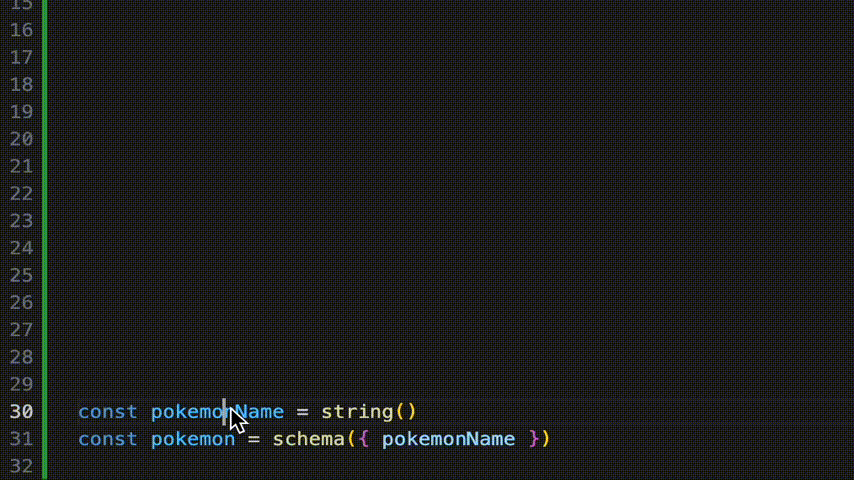

> ☝️ _NOTE: This article is about the <code>beta.1</code> release._
>
> 👉 _If you need documentation for the <code>beta.0</code> release, you may be looking for the [previous version of this article](https://dev.to/slsbytheodo/the-dynamodb-toolbox-v1-beta-is-here-all-you-need-to-know-22op)._
>
> 👉 _If you want to migrate from the <code>beta.0</code> to the <code>beta.1</code>, there is a [dedicated article](TODO) summarizing the changes._

At [Theodo](https://dev.to/slsbytheodo), we are big fans of Jeremy Daly’s [DynamoDB-Toolbox](https://github.com/jeremydaly/dynamodb-toolbox). We started using it as early as 2019 and grew fond of it... but were also well aware of its flaws 😅

One of them was that it had originally been coded in JavaScript. Although Jeremy rewrote the source code in TypeScript in 2020, it didn't handle type inference, a feature that I eventually came to implement myself in the [v0.4](https://github.com/jeremydaly/dynamodb-toolbox/releases/tag/v0.4.0).

However, there were still some features that we felt lacked: From declaring **`enums` on primitives**, to supporting **recursive schemas and types** (lists and maps sub-attributes) and **polymorphism**.

I was also wary of the object-oriented approach: I don’t have anything against classes, but they are not tree-shakable. Meaning that **they should be kept relatively light in a serverless context**. That’s what AWS went for with the [v3 of their SDK](https://docs.aws.amazon.com/AWSJavaScriptSDK/v3/latest/clients/client-dynamodb/#usage), and for good reasons: Keep bundles tight!

That just wasn't the case for DynamoDB-Toolbox: I remember working on an `.update` method that was more than 1000 lines long... But why bundle it when you don't even need it?

So last year, I decided to throw myself into a complete overhaul of the code, with three main objectives:

- Support the v3 of the AWS SDK (although [support has been added in the v0.8](https://github.com/jeremydaly/dynamodb-toolbox#using-aws-sdk-v2))
- Get the API and type inference on par with those of more "modern" tools like [zod](https://github.com/colinhacks/zod) and [electrodb](https://electrodb.fun/)
- Use a more functional and tree-shakable approach

Today, I am happy to announce the **v1 beta of dynamodb-toolbox is out** 🙌 It includes reworked `Table` and `Entity` classes, as well as complete support for `PutItem`, `GetItem`, `UpdateItem` and `DeleteItem` commands (including conditions and projections), with `Query` and `Scan` commands soon to follow.

This article details how the new API works and the main breaking changes from previous versions - which, by the way, only concern the API: No data migration needed 🥳

Let's dive in!

## Table of content

- [Installation](#installation)
- [Tables](#tables)
- [Entities](#entities)
  - [Timestamps](#timestamps)
  - [Matching the Table schema](#matching-the-table-schema)
  - [`SavedItem` and `FormattedItem`](#saveditem-and-formatteditem)
- [Designing Entity schemas](#designing-entity-schemas)
  - [Schema definition](#schema-definition)
  - [Attributes types](#attributes-types)
    - [`any`](#any)
    - [`<primitive>`](#primitives)
    - [`set`](#set)
    - [`list`](#list)
    - [`map`](#map)
    - [`record`](#record)
    - [`anyOf`](#anyof)
    - [Looking forward](#looking-forward)
- [Computed defaults](#computed-defaults)
- [Commands](#commands)
  - [`PutItemCommand`](#putitemcommand)
  - [`GetItemCommand`](#getitemcommand)
  - [`DeleteItemCommand`](#deleteitemcommand)
  - [`UpdateItemCommand`](#updateitemcommand)
- [Mocking entities in tests](#mocking-entities-in-tests)
- [Utility helpers and types](#utility-helpers-and-types)
  - [`formatSavedItem`](#formatsaveditem)
  - [`Condition` and `parseCondition`](#condition-and-parsecondition)
  - [`Projection` and `parseProjection`](#projection-and-parseprojection)
  - [`KeyInput` and `PrimaryKey`](#keyinput-and-primarykey)
- [Errors](#errors)
- [Conclusion](#conclusion)

## Installation

```bash
### npm
npm i dynamodb-toolbox@1.0.0-beta.1

## yarn
yarn add dynamodb-toolbox@1.0.0-beta.1

## ...and so on
```

The `v1` is built on top the `v3` of the AWS SDK. It has `@aws-sdk/client-dynamodb` and `@aws-sdk/lib-dynamodb` as peer dependencies so you’ll have to install them as well:

```bash
## npm
npm i @aws-sdk/client-dynamodb @aws-sdk/lib-dynamodb

## yarn
yarn add @aws-sdk/client-dynamodb @aws-sdk/lib-dynamodb

## ...and so on
```

## Tables

Tables are defined pretty much the same way as in previous versions, but the `key` attributes now have a `type` along with their `name`:

```tsx
import { DynamoDBClient } from '@aws-sdk/client-dynamodb';
import { DynamoDBDocumentClient } from '@aws-sdk/lib-dynamodb';
// Will be renamed Table in the official release 😉
import { TableV2 } from 'dynamodb-toolbox';

const dynamoDBClient = new DynamoDBClient({});
const documentClient = DynamoDBDocumentClient.from(dynamoDBClient);

const myTable = new TableV2({
  name: 'MySuperTable',
  partitionKey: {
    name: 'PK',
    type: 'string', // 'string' | 'number' | 'binary'
  },
  sortKey: {
    name: 'SK',
    type: 'string',
  },
  documentClient,
});
```

> ☝️ _The v1 does not support indexes yet as queries are not yet available._

The table name can be provided with a getter, which can be useful in some contexts where you may want to use the class without actually running any command (e.g. tests or deployments):

```tsx
const myTable = new TableV2({
  ...
  // 👇 Only executed at command execution
  name: () => process.env.TABLE_NAME,
});
```

As in previous versions, the `v1` classes tag your data with an entity identifier through an internal `entity` string attribute, saved as `"_et"` by default. This can be renamed at the `Table` level through the `entityAttributeSavedAs` argument:

```tsx
const myTable = new TableV2({
  ...
  // 👇 defaults to "_et"
  entityAttributeSavedAs: '__entity__',
});
```

## Entities

For Entities, the main change is that the `attributes` argument becomes `schema`:

```tsx
// Will be renamed Entity in the official release 😉
import { EntityV2, schema } from 'dynamodb-toolbox';

const myEntity = new EntityV2({
  name: 'MyEntity',
  table: myTable,
  // Attributes definition
  schema: schema({ ... }),
});
```

### Timestamps

The internal timestamp attributes are also there and behave similarly as in the [previous versions](https://www.dynamodbtoolbox.com/docs/entity#specifying-entity-definitions). You can set the `timestamps` to `false` to disable them (default value is `true`), or fine-tune the `created` and `modified` attributes names:

```tsx
const myEntity = new EntityV2({
  ...
  // 👇 de-activate timestamps altogether
  timestamps: false,
});

const myEntity = new EntityV2({
  ...
  timestamps: {
    // 👇 de-activate only `created` attribute
    created: false,
    modified: true,
  },
});

const myEntity = new EntityV2({
  ...
  timestamps: {
    created: {
      // 👇 defaults to "created"
      name: 'creationDate',
      // 👇 defaults to "_ct"
      savedAs: '__createdAt__',
    },
    modified: {
      // 👇 defaults to "modified"
      name: 'lastModificationDate',
      // 👇 defaults to "_md"
      savedAs: '__lastMod__',
    },
  },
});
```

### Matching the Table schema

An important change from previous versions is that the `EntityV2` key attributes are validated against the `TableV2` schema, both through types and at run-time. There are two ways to match the table schema:

- The simplest one is to have an entity schema that **already matches the table schema** (see ["Designing Entity schemas"](#designing-entity-schemas)). The Entity is then considered valid and no other argument is required:

```tsx
import { string } from 'dynamodb-toolbox';

const pokemonEntity = new EntityV2({
  name: 'Pokemon',
  table: myTable, // <= { PK: string, SK: string } primary key
  schema: schema({
    // Provide a schema that matches the primary key
    PK: string().key(),
    // 🙌 using "savedAs" will also work
    pokemonId: string().key().savedAs('SK'),
    ...
  }),
});
```

- If the entity key attributes don't match the table schema, the `Entity` class will require you to add a `computeKey` property which must derive the primary key from them:

```tsx
const pokemonEntity = new EntityV2({
  ...
  table: myTable, // <= { PK: string, SK: string } primary key
  schema: schema({
    pokemonClass: string().key(),
    pokemonId: string().key(),
    ...
  }),
  // 🙌 `computeKey` is correctly typed
  computeKey: ({ pokemonClass, pokemonId }) => ({
    PK: pokemonClass,
    SK: pokemonId,
  }),
});
```

### SavedItem and FormattedItem

If you feel lost, you can always use the `SavedItem` and `FormattedItem` utility types to infer the type of your entity items:

```tsx
import type { FormattedItem, SavedItem } from 'dynamodb-toolbox';

const pokemonEntity = new EntityV2({
  name: 'Pokemon',
  timestamps: true,
  table: myTable,
  schema: schema({
    pokemonClass: string().key().savedAs('PK'),
    pokemonId: string().key().savedAs('SK'),
    level: number().default(1),
    customName: string().optional(),
    internalField: string().hidden(),
  }),
});

// What Pokemons will look like in DynamoDB
type SavedPokemon = SavedItem<typeof pokemonEntity>;
// 🙌 Equivalent to:
// {
//   _et: "Pokemon",
//   _ct: string,
//   _md: string,
//   PK: string,
//   SK: string,
//   level: number,
//   customName?: string | undefined,
//   internalField: string | undefined,
// }

// What fetched Pokemons will look like in your code
type FormattedPokemon = FormattedItem<typeof pokemonEntity>;
// 🙌 Equivalent to:
// {
//   created: string,
//   modified: string,
//   pokemonClass: string,
//   pokemonId: string,
//   level: number,
//   customName?: string | undefined,
// }
```

## Designing Entity schemas

Now let’s dive into the part that received the most significant overhaul: **Schema definition**.

### Schema definition

Similarly to [zod](https://github.com/colinhacks/zod) or [yup](https://github.com/jquense/yup), attributes are now defined through function builders. For TS users, this removes the need for the `as const` statement previously needed for type inference (so don't forget to remove it when you migrate 🙈).

You can either import the attribute builders through their dedicated imports, or through the `attribute` or `attr` shorthands. For instance, those declarations will output the same attribute schema:

```tsx
import { string, attribute, attr } from 'dynamodb-toolbox';

// 👇 More tree-shakable
const pokemonName = string();
// 👇 Not tree-shakable, but single import
const pokemonName = attribute.string();
const pokemonName = attr.string();
```

Prior to being wrapped in a `schema` declaration, attributes are called **warm:** They are **not validated** (at run-time) and can be used to build other schemas. By inspecting their types, you will see that they are prefixed with `$`. Once **frozen**, validation is applied and building methods are stripped:



The main takeaway is that **warm schemas can be composed** while **frozen schemas cannot**:

```tsx
import { schema } from 'dynamodb-toolbox';

const pokemonName = string();

const pokemonSchema = schema({
  // 👍 No problem
  pokemonName,
  ...
});

const pokedexSchema = schema({
  // ❌ Not possible
  pokemon: pokemonSchema,
  ...
});
```

You can create/update warm attributes by using dedicated methods or by providing option objects. The former provides a **slick devX** with autocomplete and shorthands, while the latter theoretically requires **less compute time and memory usage**, although it should be very minor (validation being only applied on freeze):

```tsx
// Using methods
const pokemonName = string().required('always');
// Using options
const pokemonName = string({ required: 'always' });
```

All attributes share the following options:

- `required` _(string?="atLeastOnce")_ Tag a root attribute or Map sub-attribute as **required**. Possible values are:
  - `"atLeastOnce"` Required in `PutItem` commands
  - `"never"`: Optional in all commands
  - `"always"`: Required in all commands

```tsx
// Equivalent
const pokemonName = string().required();
const pokemonName = string({ required: 'atLeastOnce' });

// `.optional()` is a shorthand for `.required(”never”)`
const pokemonName = string().optional();
const pokemonName = string({ required: 'never' });
```

A very important breaking change from previous versions is that **root attributes and Map sub-attributes are now required by default**. This was made so **composition and validation work better together**.

> 💡 _Outside of root attributes and Map sub-attributes, such as in a list of strings, it doesn’t make sense for sub-schemas to be optional. So, should I force users to write `list(string().required())` every time OR make string validation and type inference aware of their context (ignore `required` in lists but not in maps)? It felt more elegant to enforce `string()` as required by default and prevent schemas such as `list(string().optional())`._

- `hidden` _(boolean?=true)_ Skip attribute when formatting the returned item of a command:

```tsx
const pokemonName = string().hidden();
const pokemonName = string({ hidden: true });
```

- `key` _(boolean?=true)_ Tag attribute as needed to compute the primary key:

```tsx
// Note: The method will also modify the `required` property to "always"
// (it is often the case in practice, you can still use `.optional()` if needed)
const pokemonName = string().key();
const pokemonName = string({ key: true, required: 'always' });
```

- `savedAs` _(string)_ Previously known as `map`. Rename a root or Map sub-attribute before sending commands:

```tsx
const pokemonName = string().savedAs('_n');
const pokemonName = string({ savedAs: '_n' });
```

- `default`: _(ComputedDefault)_ See [Computed defaults](#computed-defaults)

### Attributes types

Here’s the exhaustive list of available attribute types:

#### Any

Define an attribute of any value. No validation will be applied at run-time, and its type will be resolved as `unknown`:

```tsx
import { any } from 'dynamodb-toolbox';

const pokemonSchema = schema({
  ...
  metadata: any(),
});

type FormattedPokemon = FormattedItem<typeof pokemonEntity>;
// => {
//   ...
//   metadata: unknown
// }
```

You can provide default values through the `defaults` option or the `keyDefault`, `putDefault` and `updateDefault` methods. A simpler `default` method is also exposed. It acts similarly as `putDefault`, except if the attribute has been tagged as a `key` attribute, in which case it will act as `keyDefault`:

```tsx
const metadata = any().default({ any: 'value' });
// 👇 Similar to
const metadata = any().putDefault({ any: 'value' });
// 👇 ...or
const metadata = any({
  defaults: {
    key: undefined,
    put: { any: 'value' },
    update: undefined,
  },
});

const keyPart = any().key().default('my-awesome-partition-key');
// 👇 Similar to
const metadata = any().key().keyDefault('my-awesome-partition-key');
// 👇 ...or
const metadata = any({
  key: true,
  defaults: {
    key: 'my-awesome-partition-key',
    // put & update defaults are not useful in `key` attributes
    put: undefined,
    update: undefined,
  },
});

const metadata = any().default(() => 'Getters also work!');
```

#### Primitives

Defines a `string`, `number`, `boolean` or `binary` attribute:

```tsx
import { string, number, boolean, binary } from 'dynamodb-toolbox';

const pokemonSchema = schema({
  ...
  pokemonType: string(),
  level: number(),
  isLegendary: boolean(),
  binEncoded: binary(),
});

type FormattedPokemon = FormattedItem<typeof pokemonEntity>;
// => {
//   ...
//   pokemonType: string
//   level: number
//   isLegendary: boolean
//   binEncoded: Buffer
// }
```

Similarly to `any` attributes, you can provide default values through the `defaults` option or the `default` methods:

```tsx
// 🙌 Correctly typed!
const creationDate = string().default(() => new Date().toISOString());
// 👇 Similar to
const creationDate = string().putDefault(() => new Date().toISOString());
// 👇 ...or
const creationDate = string({
  defaults: {
    key: undefined,
    put: () => new Date().toISOString(),
    update: undefined,
  },
});

// 👇 Additionally fill 'creationDate' on updates if needed
import { $get } from 'dynamodb-toolbox';

const creationDate = string()
  .putDefault(() => new Date().toISOString())
  // (See UpdateItemCommand section for $get description)
  .updateDefault(() => $get('creationDate', new Date().toISOString()));
// 👇 Similar to
const creationDate = string({
  defaults: {
    key: undefined,
    put: () => new Date().toISOString(),
    update: () => $get('creationDate', new Date().toISOString()),
  },
});

const id = number().key().default(1);
// 👇 Similar to
const id = number().key().keyDefault(1);
// 👇 ...or
const id = number({
  defaults: {
    key: 1,
    // put & update defaults are not useful in `key` attributes
    put: undefined,
    update: undefined,
  },
});
```

Primitive types have an additional `enum` option. For instance, you could provide a finite list of pokemon types:

```tsx
const pokemonTypeAttribute = string().enum('fire', 'grass', 'water');

// Shorthand for `.enum("POKEMON").default("POKEMON")`
const pokemonPartitionKey = string().const('POKEMON');
```

> 💡 _For type inference reasons, the `enum` option is only available as a method, not as an object option_

#### Set

Defines a set of strings, numbers or binaries. Unlike in previous versions, sets are kept as `Set` classes. Let me know if you would prefer using arrays (or being able to choose from both):

```tsx
import { set } from 'dynamodb-toolbox';

const pokemonSchema = schema({
  ...
  skills: set(string()),
});

type FormattedPokemon = FormattedItem<typeof pokemonEntity>;
// => {
//   ...
//   skills: Set<string>
// }
```

Options can be provided as a 2nd argument:

```tsx
const setAttr = set(string()).hidden();
const setAttr = set(string(), { hidden: true });
```

#### List

Defines a list of sub-schemas of any type:

```tsx
import { list } from 'dynamodb-toolbox';

const pokemonSchema = schema({
  ...
  skills: list(string()),
});

type FormattedPokemon = FormattedItem<typeof pokemonEntity>;
// => {
//   ...
//   skills: string[]
// }
```

As in sets, options can be povided as a 2nd argument.

#### Map

Defines a finite list of key-value pairs. Keys must follow a string schema, while values can be sub-schema of any type:

```tsx
import { map } from 'dynamodb-toolbox';

const pokemonSchema = schema({
  ...
  nestedMagic: map({
    will: map({
      work: string().const('!'),
    }),
  }),
});

type FormattedPokemon = FormattedItem<typeof pokemonEntity>;
// => {
//   ...
//   nestedMagic: {
//     will: {
//       work: "!"
//     }
//   }
// }
```

As in sets and lists, options can be povided as a 2nd argument.

#### Record

A new attribute type that translates to `Partial<Record<KeyType, ValueType>>` in TypeScript. Records differ from maps as they can accept an infinite range of keys and are always partial:

```tsx
import { record } from 'dynamodb-toolbox';

const pokemonType = string().enum(...);

const pokemonSchema = schema({
  ...
  weaknessesByPokemonType: record(pokemonType, number()),
});

type FormattedPokemon = FormattedItem<typeof pokemonEntity>;
// => {
//   ...
//   weaknessesByPokemonType: {
//     [key in PokemonType]?: number
//   }
// }
```

Options can be provided as a 3rd argument:

```tsx
const recordAttr = record(string(), number()).hidden();
const recordAttr = record(string(), number(), { hidden: true });
```

#### AnyOf

A new <b>meta-</b>attribute type that represents a union of types, i.e. a range of possible types:

```tsx
import { anyOf } from 'dynamodb-toolbox';

const pokemonSchema = schema({
  ...
  pokemonType: anyOf([
    string().const('fire'),
    string().const('grass'),
    string().const('water'),
  ]),
});
```

In this particular case, an `enum` would have done the trick. However, `anyOf` becomes particularly powerful when used in conjunction with a `map` and the `enum` or `const` directives of a primitive attribute, to implement **polymorphism**:

```tsx
const pokemonSchema = schema({
  ...
  captureState: anyOf([
    map({
      status: string().const('caught'),
      // 👇 captureState.trainerId exists if status is "caught"...
      trainerId: string(),
    }),
    // ...but not otherwise! 🙌
    map({ status: string().const('wild') }),
  ]),
});

type CaptureState = FormattedItem<typeof pokemonEntity>['captureState'];
// 🙌 Equivalent to:
// | { status: "wild" }
// | { status: "caught", trainerId: string }
```

As in sets, lists and maps, options can be povided as a 2nd argument.

#### Looking forward

That’s all for now! I’m planning on including new `null`, `tuple` and `allOf` attributes at some point.

If there are other types you’d like to see, feel free to leave a comment on this article and/or [open a discussion on the official repo](https://github.com/jeremydaly/dynamodb-toolbox) with the `v1` label 👍

## Computed defaults

In previous versions, `default` was used to compute attribute from other attributes values. This feature was very handy for "technical" attributes such as composite indexes.

However, it was just impossible to type correctly in TypeScript:

```tsx
const pokemonSchema = schema({
  ...
  level: number(),
  levelPlusOne: number().default(
    // ❌ No way to retrieve the caller context
    input => input.level + 1,
  ),
});
```

It means the `input` was typed as any and it fell to the developper to type it correctly, which just didn’t cut it for me.

The solution I committed to was to split computed defaults declaration into 2 steps:

- First, **declare that an attribute default should be derived from other attributes**:

```tsx
import { ComputedDefault } from 'dynamodb-toolbox';

const pokemonSchema = schema({
  ...
  level: number(),
  levelPlusOne: number().default(ComputedDefault),
});
```

> 💡 _`ComputedDefault` is a JavaScript [Symbol](https://developer.mozilla.org/en-US/docs/Web/JavaScript/Reference/Global_Objects/Symbol) (TLDR: A sort of unique and custom `null`), so it cannot possibly conflict with an actual desired default value._

- Then, declare a way to compute this attribute **at the entity level**, through the `putDefaults` property:

```tsx
const pokemonEntity = new EntityV2({
  ...
  schema: pokemonSchema,
  putDefaults: {
    // 🙌 Correctly typed!
    levelPlusOne: ({ level }) => level + 1,
  },
});
```

- The same can be applied to `updateDefaults` (or both):

```tsx
import { $get } from 'dynamodb-toolbox';

const pokemonSchema = schema({
  ...
  level: number(),
  previousLevel: number().updateDefault(ComputedDefault),
});

const pokemonEntity = new EntityV2({
  ...
  schema: pokemonSchema,
  updateDefaults: {
    // 🙌 Correctly typed!
    previousLevel: ({ level }) =>
      // Update 'previousLevel' only if 'level' is updated
      level !== undefined ? $get('level') : undefined,
  },
});
```

In the tricky case of nested attributes, `putDefaults` and `updateDefaults` become objects with an `_attributes` or `_elements` property to emphasize that the computing is **local**:

```tsx
const pokemonSchema = schema({
  ...
  defaultLevel: number(),
  // 👇 Defaulted Map attribute
  levelHistory: map({
    currentLevel: number(),
    // 👇 Defaulted sub-attribute
    nextLevel: number().default(ComputedDefault),
  }).default(ComputedDefault),
});

const pokemonEntity = new EntityV2({
  ...
  schema: pokemonSchema,
  putDefaults: {
    levelHistory: {
      // Defaulted value of Map attribute
      _map: item => ({
        currentLevel: item.defaultLevel,
        nextLevel: item.defaultLevel,
      }),
      _attributes: {
        // Defaulted value of sub-attribute
        nextLevel: (levelHistory, item) => levelHistory.currentLevel + 1,
      },
    },
  },
});
```

## Commands

Now that we know how to design entities, let’s take a look at how we can leverage them to craft commands 👍

> 💡 _The beta only supports the `PutItem`, `GetItem`, `UpdateItem` and `DeleteItem` commands. If you need to run `Query` or `Scan` commands, my advice is to run native SDK commands and format their output with the [`formatSavedItem` util](#formatsaveditem)._

As mentioned in the intro, I searched for a syntax that favored tree-shaking. Here's an example of it, with the `PutItem` command:

```tsx
// v0.x Not tree-shakable
const response = await pokemonEntity.put(pokemonItem, options);

// v1 Tree-shakable 🙌
import { PutItemCommand } from 'dynamodb-toolbox';

const command = new PutItemCommand(
  pokemonEntity,
  // 🙌 Correctly typed!
  pokemonItem,
  // 👇 Optional
  putItemOptions,
);

// Get command params
const params = command.params();
// Send command
const response = await command.send();
```

`pokemonItem` can be provided later or edited:

```tsx
import { PutItemCommand } from 'dynamodb-toolbox';

const incompleteCommand = new PutItemCommand(pokemonEntity);

// (will return a new command and not mutate the original one)
const completeCommand = incompleteCommand.item(pokemonItem);

// (can be chained by design)
const response = await incompleteCommand
  .item(pokemonItem)
  .options(options)
  .send();
```

You can also use the `.build` method of the entity to craft a command directly hydrated with your entity:

```tsx
// 🙌 We get a syntax closer to v0.x... but tree-shakable!
const response = await pokemonEntity
  .build(PutItemCommand)
  .item(pokemonItem)
  .options(options)
  .send();
```

### PutItemCommand

The `capacity`, `metrics` and `returnValues` options behave exactly the same as in previous versions. The `condition` option benefits from improved typing, and clearer logical combinations:

```tsx
import { PutItemCommand } from 'dynamodb-toolbox';

const { Attributes } = await pokemonEntity
  .build(PutItemCommand)
  .item(pokemonItem)
  .options({
    capacity: 'TOTAL',
    metrics: 'SIZE',
    // 👇 Will type the response `Attributes`
    returnValues: 'ALL_OLD',
    condition: {
      or: [
        { attr: 'pokemonId', exists: false },
        // 🙌 "lte" is correcly typed
        { attr: 'level', lte: 99 },
        // 🙌 You can nest logical combinations
        { and: [{ not: { ... } }, ...] },
      ],
    },
  })
  .send();
```

### GetItemCommand

The `attributes` option behaves the same as in previous versions, but benefits from improved typing as well:

```tsx
import { GetItemCommand } from 'dynamodb-toolbox';

const { Item } = await pokemonEntity
  .build(GetItemCommand)
  .key(pokemonKey)
  .options({
    capacity: 'TOTAL',
    consistent: true,
    // 👇 Will type the response `Item`
    attributes: ['pokemonId', 'pokemonType', 'level'],
  })
  .send();
```

### DeleteItemCommand

The `DeleteItem` command is pretty much a mix between the `PutItem` and `GetItem` commands ones, options wise:

```tsx
import { DeleteItemCommand } from 'dynamodb-toolbox';

const { Attributes } = await pokemonEntity
  .build(DeleteItemCommand)
  .key(pokemonKey)
  .options({
    capacity: 'TOTAL',
    metrics: 'SIZE',
    // 👇 Will type the response `Attributes`
    returnValues: 'ALL_OLD',
    condition: {
      or: [
        { attr: 'level', lte: 99 },
        ...
      ],
    },
  })
  .send();
```

### UpdateItemCommand

The `UpdateCommand` is the richest of all DynamoDB commands. Its options are similar to the `PutItemCommand` options:

```tsx
import { UpdateItemCommand } from 'dynamodb-toolbox';

const { Item } = await pokemonEntity
  .build(UpdateItemCommand)
  .item(pokemonItem)
  .options({
    capacity: 'TOTAL',
    metrics: 'SIZE',
    // 👇 Will type the response `Attributes`
    returnValues: 'ALL_NEW',
    condition: {
      or: [
        { attr: 'level', lte: 99 },
        ...
      ],
    },
  })
  .send();
```

However, its `item` method offers many more possibilities 🙌 Let's explore them:

#### Removing an attribute

Any optional attribute can be removed with the `$remove` util:

```tsx
import { $remove } from 'dynamodb-toolbox';

const pokemonSchema = schema({
  ...
  isLegendary: boolean().optional(),
});

pokemonEntity.build(UpdateItemCommand).item({
  ...
  isLegendary: $remove(),
});
```

#### Referencing saved values

You can reference a saved attribute value by using the `$get` util:

```tsx
import { $get } from 'dynamodb-toolbox';

pokemonEntity.build(UpdateItemCommand).item({
  ...
  // 👇 Resolved by DynamoDB at write time
  previousLevel: $get('level'),
});
```

Self-references are possible. You can also provide a fallback value as 2nd argument in case the specified attribute path misses from the saved item:

```tsx
pokemonEntity.build(UpdateItemCommand).item({
  ...
  previousLevel: $get('level', 1),
  // 👇 fallback can also be a reference!
  chainedRefs: $get(
    'firstRef',
    $get('secondRef', 'Sky is the limit!'),
  ),
});
```

Note that the attribute path is type-checked, but wether its attribute value extends the updated attribute value is **not** for the moment, so be extra-careful:

```tsx
const pokemonSchema = schema({
  ...
  name: string(),
  level: number(),
});

pokemonEntity.build(UpdateItemCommand).item({
  // ❌ Will be caught
  name: $get('non.existing[0].attribute'),
  // 🙈 Will NOT be caught
  level: $get('name'),
});
```

#### Non-recursive attributes

In the case of non-recursive attributes, e.g. primitives and `sets`, updates will completely override their previous values:

```tsx
const pokemonSchema = schema({
  ...
  isLegendary: boolean(),
  level: number(),
  name: string(),
  binEncoded: binary(),
  skills: set(string()),
});

pokemonEntity.build(UpdateItemCommand)
  .item({
    ...
    // 👇 Set fields to desired values
    isLegendary: true,
    nextLevel: 42,
    name: 'Pikachu',
    binEncoded: Buffer.from(...),
    skills: new Set(['thunder'])
  })
```

`number` attributes benefit from additional `$sum`, `$subtract` and `$add` operations, which can use references:

```tsx
import { $add, $subtract, $get } from 'dynamodb-toolbox';

await pokemonEntity.build(UpdateItemCommand)
  .item({
    ...
    health: $subtract($get('health'), 20),
    level: $sum($get('level', 0), 1),
    // 👇 Similar to
    level: $add(1),
  })
  .send();
```

To add or remove specific values from a set, you can use the `$add` and `$delete` utils:

```tsx
pokemonEntity.build(UpdateItemCommand)
  .item({
    ...
    skills: $add('thunder', 'dragon-tail'),
    types: $delete('flight'),
  })
```

#### Recursive attributes

In the case of recursive attributes, e.g. `lists`, `maps` and `records`, updates are **partial by default**. You can use the `$set` to specify a complete override:

```tsx
const pokemonSchema = schema({
  ...
  types: list(string()),
  skills: list(string()),
  some: map({
    nested: map({
      field: string(),
      otherField: number(),
    }),
  }),
  bestSkillByType: record(string(), string()),
});

// 👇 Partial overrides
pokemonEntity.build(UpdateItemCommand).item({
  ...
  // 👇 Indexes 0 and 2 will be updated
  skills: ['thunder', undefined, $remove()],
  // 👇 Similar to
  skills: {
    0: 'thunder',
    2: $remove(),
  },
  some: {
    nested: {
      field: 'foo',
    },
  },
  bestSkillByType: {
    electric: 'thunder',
    flight: $remove(),
  },
});

import { $set } from 'dynamodb-toolbox';

// 👇 Complete overrides
pokemonEntity.build(UpdateItemCommand).item({
  ...
  skills: $set(['thunder']),
  some: $set({
    nested: {
      field: 'foo',
      otherField: 42,
    },
  }),
  bestSkillByType: $set({
    electric: 'thunder',
  }),
});
```

`lists` attributes benefit from additional `$append` and `$prepend` operations, which can use references:

```tsx
pokemonEntity.build(UpdateItemCommand).item({
  ...
  skills: $append(['thunder', 'dragon-tail']),
  levelHistory: $append($get('level')),
  types: $prepend(['flight']),
});
```

#### Any and anyOf attributes

The `any` attribute supports all the syntaxes specified above. `anyOf` attributes updates are not supported yet.

## Mocking entities in tests

As much as I appreciate this chained syntax, it makes mocking hard in unit tests. For this reason, the `v1` exposes a `mockEntity` util to help you mock commands:

```tsx
import { mockEntity } from 'dynamodb-toolbox';

const mockedPokemonEntity = mockEntity(pokemonEntity);

mockedPokemonEntity.on(GetItemCommand).resolve({
  // 🙌 Type-safe!
  Item: {
    pokemonId: 'pikachu1',
    name: 'Pikachu',
    level: 42,
    ...
  },
});

// 👇 For more fine-grained control
mockedPokemonEntity
  .on(GetItemCommand)
  .mockImplementation((key, options) => ({
    // 🙌 Still type-safe!
    Item: {
      pokemonId: 'pikachu1',
      ...
    },
  }));

//👇 To simulate errors
mockedPokemonEntity.on(GetItemCommand).reject('Something bad happened');
```

You can then make assertions on received commands:

```tsx
await pokemonEntity
  .build(GetItemCommand)
  .key({ pokemonId: 'pikachu1' })
  .options({ consistent: true })
  .send();
// => Will return mocked values!

mockedPokemonEntity.received(GetItemCommand).count();
// => 1
mockedPokemonEntity.received(GetItemCommand).args(0);
// => [{ pokemonId: 'pikachu1' }, { consistent: true }]
mockedEntity.received(GetItemCommand).allArgs();
// => [[{ pokemonId: 'pikachu1' }, { consistent: true }], ...anyOtherCall]
```

## Utility helpers and types

In addition to the `SavedItem` and `FormattedItem` types, the `v1` exposes a bunch of useful helpers and utility types:

### formatSavedItem

`formatSavedItem` transforms a saved item returned by the DynamoDB client to it’s formatted counterpart:

```tsx
import { formatSavedItem } from 'dynamodb-toolbox';

// 🙌 Typed as FormattedItem<typeof pokemonEntity>
const formattedPokemon = formatSavedItem(
  pokemonEntity,
  savedPokemon,
  // As in GetItem commands, attributes will filter the formatted item
  { attributes: [...] },
);
```

Note that **it is a parsing operation**, i.e. it does not require the item to be typed as `SavedItem<typeof myEntity>`, but will throw an error if the saved item is invalid:

```tsx
const formattedPokemon = formatSavedItem(pokemonEntity, {
  ...
  level: 'not a number',
});
// ❌ Will raise error:
// => "Invalid attribute in saved item: level. Should be a number"
```

### Condition and parseCondition

The `Condition` type and `parseCondition` util are useful to type conditions and build condition expressions:

```tsx
import { Condition, parseCondition } from 'dynamodb-toolbox';

const condition: Condition<typeof pokemonEntity> = {
  attr: 'level',
  lte: 42,
};

const parsedCondition = parseCondition(pokemonEntity, condition);
// => {
//   ConditionExpression: "#c1 <= :c1",
//   ExpressionAttributeNames: { "#c1": "level" },
//   ExpressionAttributeValues: { ":c1": 42 },
// }
```

### Projection and parseProjection

The `AnyAttributePath` type and `parseProjection` util are useful to type attribute paths and build projection expressions:

```tsx
import { AnyAttributePath, parseProjection } from 'dynamodb-toolbox';

const attributes: AnyAttributePath<typeof pokemonEntity>[] = [
  'pokemonType',
  'levelHistory.currentLevel',
];

const parsedProjection = parseProjection(pokemonEntity, attributes);
// => {
//   ProjectionExpression: '#p1, #p2.#p3',
//   ExpressionAttributeNames: {
//     '#p1': 'pokemonType',
//     '#p2': 'levelHistory',
//     '#p3': 'currentLevel',
//   },
// }
```

### KeyInput and PrimaryKey

Both types are useful to type item primary keys:

```tsx
import type { KeyInput, PrimaryKey } from 'dynamodb-toolbox';

type PokemonKeyInput = KeyInput<typeof pokemonEntity>;
// => { pokemonClass: string, pokemonId: string }

type MyTablePrimaryKey = PrimaryKey<typeof myTable>;
// => { PK: string, SK: string }
```

## Errors

Finally, let’s take a quick look at error management. When DynamoDB-Toolbox encounters an unexpected input, it will throw an instance of `DynamoDBToolboxError`, which itself extends the native `Error` class with a `code` property:

```tsx
await pokemonEntity
  .build(PutItemCommand)
  .item({ ..., level: 'not a number' })
  .send();
// ❌ [parsing.invalidAttributeInput] Attribute level should be a number
```

Some `DynamoDBToolboxErrors` also expose a `path` property (mostly in validations) and/or a `payload` property for additional context. If you need to handle them, TypeScript is your best friend, as the `code` property will correctly discriminate the `DynamoDBToolboxError` type:

```tsx
import { DynamoDBToolboxError } from 'dynamodb-toolbox';

const handleError = (error: Error) => {
  if (!error instanceof DynamoDBToolboxError) throw error;

  switch (error.code) {
    case 'parsing.invalidAttributeInput':
      const path = error.path;
      // => "level"
      const payload = error.payload;
      // => { received: "not a number", expected: "number" }
      break;
      ...
    case 'entity.invalidItemSchema':
      const path = error.path; // ❌ error does not have path property
      const payload = error.payload; // ❌ same goes with payload
      ...
  }
};
```

## Conclusion

And that’s it for now! I hope you’re as excited as I am about this new release 🙌

If you have features that I've missed in mind, or would like to see some of the ones I mentioned prioritized, please leave a comment on this article and/or [create an issue or open a discussion on the official repo](https://github.com/jeremydaly/dynamodb-toolbox) with the `v1` label 👍

See you soon!
